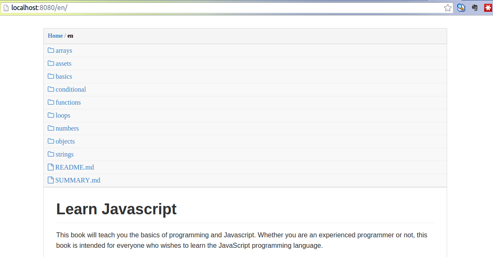

# airdoc

Serve markdown document on the air.



## Features

- Documents are structured by directory
- Multiple sources
- No database

## Install

With Composer:

```
composer require ddliu/airdoc
```

With GIT:

```
git clone https://github.com/ddliu/airdoc.git docviewer
cd docviewer
composer install
```

## Web Server

### Nginx

See nginx.conf

### Apache

`.htaccess` is already configured for Apache.

### PHP Builtin Server

```
make server
```
or

```
php -S localhost:8080 -t . router.php
```

## Config

Airdoc can be customized with config.php.

```
<?php
return [
    'title' => 'Page title',
    // add multiple document sources
    'mount' => [
        'path/to/src2' => '/', // base source
        '../path/to/src1' => '/group1',
        'path/to/src3' => '/group1/group2',
    ],
    // basic auth
    'users' => [
        'user1' => 'password1',
        'user2' => 'password2',
        'user3' => 'password3',
    ],
    // path patterns to be ignored
    'ignore_regexp' => [
        '/\.', // ignore hidden files or directories(start with dot)
        '\.php$', // ignore php file
    ],
];
?>
```

## TODO

- TOC
- Cache